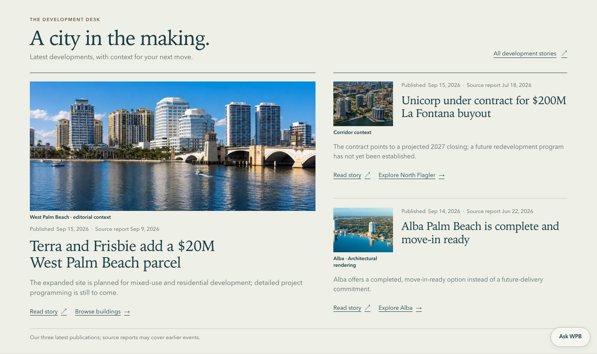
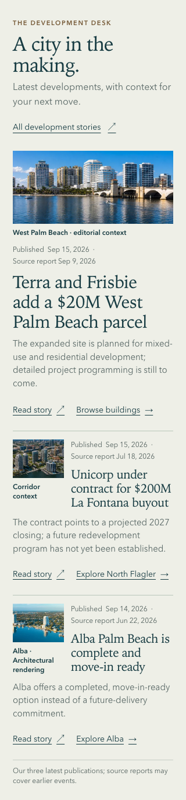
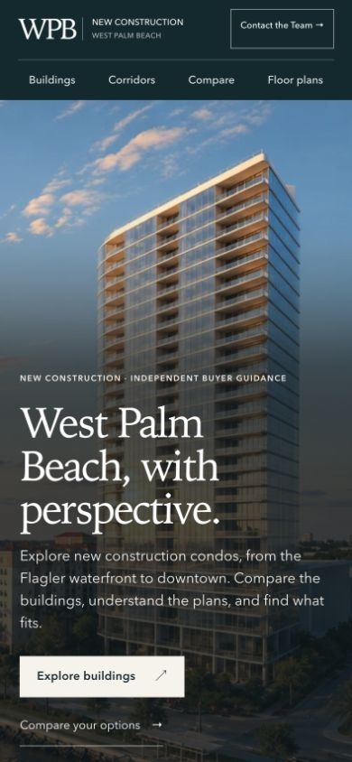
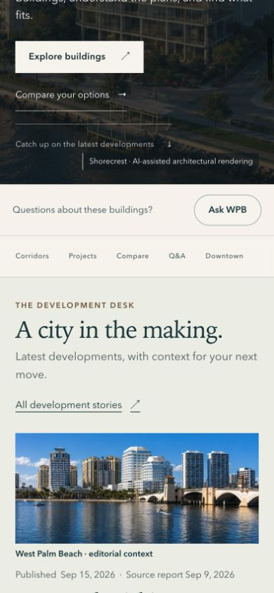
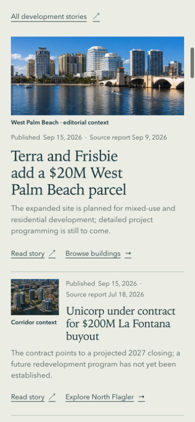
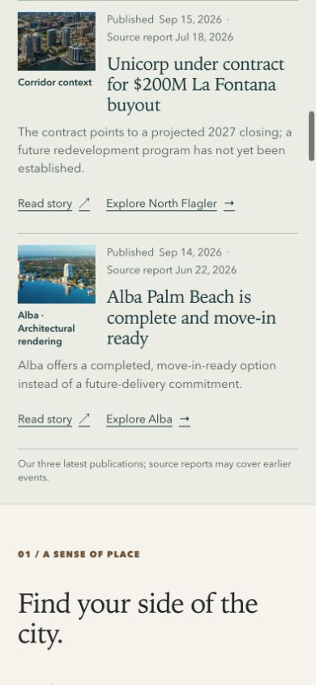

# Development Desk — independent visual and journey review

Reviewer: GPT-6 Astra, extra-high reasoning. Date: 2026-09-19.

**Final judgment: accepted for the bounded Development Desk visual change.** The two focused correction rounds are complete. No further layout correction is requested. Both reader journeys navigate successfully, with the separate pre-existing Alba project-status contradiction carried below. This is local visual/journey acceptance, not whole-site, source-fact, CI or release approval.

Scope: Development Desk in the explicitly assigned V2 worktree, branch `codex/site-overhaul-v2`, starting HEAD `5041bc179ac784300fa01fd32e399f2e8668c4d4`. No source edits, architecture audit, hero/masthead/closing redesign, commit, push, merge or deployment by this reviewer.

## Evidence states

- **Baseline visual evidence inspected:** `before/desk-section-1440x1000.png` (1440×874), `before/desk-section-390x844.png` (390×1468), and `before/desk-section-320x812.png` (320×1754). Both phone captures extend beyond their viewport and include the section's final date note. The desktop section fits within its viewport.
- **Source consistency independently checked:** the three approved JSON records' IDs, publication timestamps, source dates, buyer takeaways and corridor relationships. Terra is published 31 seconds after Unicorp on September 15; Alba is published September 14. Source dates are respectively September 9, July 18, and June 22. This checks the supplied records, not the truth or currentness of external reporting.
- **Asset provenance:** read the current bounded source inventory and art-direction memo. Their source/medium findings are supplied evidence; this reviewer has not independently audited the asset warehouse. Rendering appearance alone does not establish medium.
- **Initial AFTER visual evidence inspected:** `after/desk-section-1440x1000.png` (1440×896), `after/desk-section-390x844.png` (390×1338), and `after/desk-section-320x812.png` (320×1394), plus independently captured live phone and tablet screenshots in `fresh-evidence/`. The two supplied mobile full-section captures include an accidentally focused Skip to content control; they support layout inspection but require clean recapture before presentation.
- **Executed journeys:** recorded below. Initial in-app Browser phone override 390×844 actually produced CSS 386×835 because of its 1.01 scale. That initial journey is explicitly realistic-phone evidence, not exact-size proof. A corrected override subsequently produced and verified actual CSS 390×844 for the complete final opening sequence and corridor check. Tablet checks verified actual CSS 1024×900 and 768×900.

## Baseline diagnosis and acceptance criteria

1. **Desktop balance:** the lead's text ends far above its bottom-pinned actions, leaving a conspicuous empty field. The image-led version should give the lead deliberate visual priority while the two secondary stories remain compact briefs; natural spacing should replace stretched alignment.
2. **Phone scanability:** baseline stories share a repeated long headline/paragraph/date/two-action rhythm. The new version should show secondary headlines promptly, without making three large image cards or compressing essential caveats into tiny text.
3. **Trust and onward paths:** retain clear Published versus Source report labels, newest-publication order, and distinct story and research actions. Context images must not appear to depict acquisition sites or proposed replacement buildings; Alba's rendering label must not imply a completion photograph.

## Initial AFTER judgment and bounded corrections

The composition now reads clearly as one feature and two briefs. The lead image fills the former desktop void. On phone the smaller secondary images provide scan anchors without introducing three large image cards; the one-sentence briefs and adjacent research links are easier to scan. All three images loaded. Visible labels distinguish West Palm Beach editorial context, corridor context, and Alba architectural rendering. Published/source report dates retain their separate meanings and the supplied publication order is unchanged. No horizontal overflow was observed in the inspected phone or tablet states.

1. **P2, desktop line break — one bounded correction.** Initial 1440 capture forces the lead title into three lines with a lone “parcel” at the end, despite substantial free width. Widen the lead heading measure so the phrase sits comfortably in two lines. The root independently identified the same issue.
2. **P2, tablet image height — fold into the same round.** The live 1024 layout already stacks, so no compressed two-column defect was found. However, its roughly 922×419 lead image is oversized relative to this news section. Cap the stacked tablet image around 280 px, as the original direction proposed, while preserving the skyline/bridge crop. At 768 the same cap is a smaller reduction. Evidence: `fresh-evidence/10-tablet-1024-desk.png`, `10b-tablet-1024-copy.png`, `11-tablet-768-copy.png`.
3. **Capture cleanup, not product redesign.** Clear the focused Skip to content control before official phone screenshots. Do not hide or restyle the accessibility control to clean the image. This reviewer’s ordinary live scroll frames show the section without that overlay.

No additional mobile composition correction is requested from the initial pass. The 320 px captions wrap naturally, dates remain legible, contractual qualifications remain present, and the shorter actions fit the row. No rating or numerical quality score is assigned.

## Executed reader journeys

1. **Phone opening through Development Desk and discovery — healthy.** Ordinary overlapping scrolls from homepage top through hero, section heading, lead, both briefs and the first discovery heading. The complete sequence was repeated after correction at verified actual CSS **390×844**, with zero horizontal overflow. Final accepted frames: `fresh-evidence/final-01-phone-opening-390.png`, `final-02-phone-hero-to-desk-390.png`, `final-03-phone-lead-and-brief-390.png`, `final-04-phone-briefs-to-discovery-390.png`. Hero/masthead/closing artwork was not redesigned or audited.
2. **Returning visitor finds changes and opens a story — healthy navigation.** Activated “Catch up on the latest developments,” verified the Desk with the newest published story/date, then activated the Terra title and verified its complete article title. Evidence: `05-returning-visitor-desk-anchor.png`, `06-returning-visitor-story-open.png`.
3. **First-time visitor moves from a story to building research — navigation passes; factual continuity limitation.** Opened the Alba brief, scrolled its full article to Related Buildings, activated “View building,” and reached the Alba buyer guide. Evidence: `07-first-visitor-alba-story.png`, `08-first-visitor-related-building.png`, `08b-first-visitor-building-link.png`, `09-first-visitor-alba-project.png`.
4. **Brief to corridor research — healthy navigation.** Activated the Desk’s “Explore North Flagler” link and verified the North Flagler Waterfront Living guide at actual CSS 390×844. Evidence: `12-phone-corridor-research.png`.

## Factual continuity issue carried outside this bounded change

**Important existing destination conflict:** the Alba story and Desk say the building is complete, while `http://127.0.0.1:5186/projects/alba-palm-beach/` displays **STATUS Under Construction** in its loaded project hero. The same project page later describes completed-building resale resources. This is not a broken link or a Desk-layout failure, but it prevents claiming that the complete story-to-research experience is factually consistent. Screenshot: `fresh-evidence/09b-alba-status-conflict.png`; observed accessibility path: `main-content → Project tags → STATUS Under Construction`. Root reports that separate baseline QA reproduced the conflict at `5041bc17`: server-rendered HTML says **Completed**, while the hydrated client says **Under Construction**. The baseline attribution is that QA's finding; this reviewer independently observed the loaded current-page conflict. No canonical facts, project overrides, or project-page code were changed by this reviewer.

## Final responsive read

The corrected official full-section files were visually inspected again and are clean, with no focused Skip to content artifact: **1440×856**, **390×1314**, and **320×1369**. All extend through the final source-date explanation; phone captures exceed their viewports. The desktop lead is a balanced two-line headline. The phone title wraps without a lone final word, and its lead image retains the shallow 2.2:1 treatment. Compared with baseline, adding imagery still reduces the section from 1468 to 1314 px at 390 and from 1754 to 1369 px at 320. The contractual qualifier, publication/source distinction, contextual labels and research actions remain readable.

A first tablet-cap implementation briefly expanded the phone image to 280 px; that regression was identified and corrected before the final phone read. Rejected evidence is explicitly named `round1-cap-regression-02.png` and `round1-cap-regression-03.png` and is not final evidence. The next tablet version preserved the full source crop by shrinking the picture to 616×280 at 1024, leaving unused space to its right. The second and final correction resolves that alignment: a freshly loaded live page measures **921.4×280 px** for the lead image at actual CSS **1024×900**, with zero horizontal overflow. The skyline roofs and bridge remain visible in the shallow crop. Final evidence: `fresh-evidence/final-12-tablet-1024-fullwidth.png`; the official `after/desk-section-1024x900.png` (**1024×1185**) and `after/desk-section-768x900.png` (**768×1228**) were both inspected in full, including their final source-date notes. This closes the responsive visual read.

## Review limits

Screenshots and executed pointer navigation do not establish keyboard/screen-reader correctness or accessibility conformance. No external news claims, current inventory, price or project-status facts were independently reverified. Remote PR, CI, deployment and installed-device verification are outside this independent review. No further correction round is requested, and no source files were edited by this reviewer.

## Accepted screenshots

Final desktop section:

Final narrow-phone section:

Final exact 390×844 opening sequence, in uninterrupted reading order:

