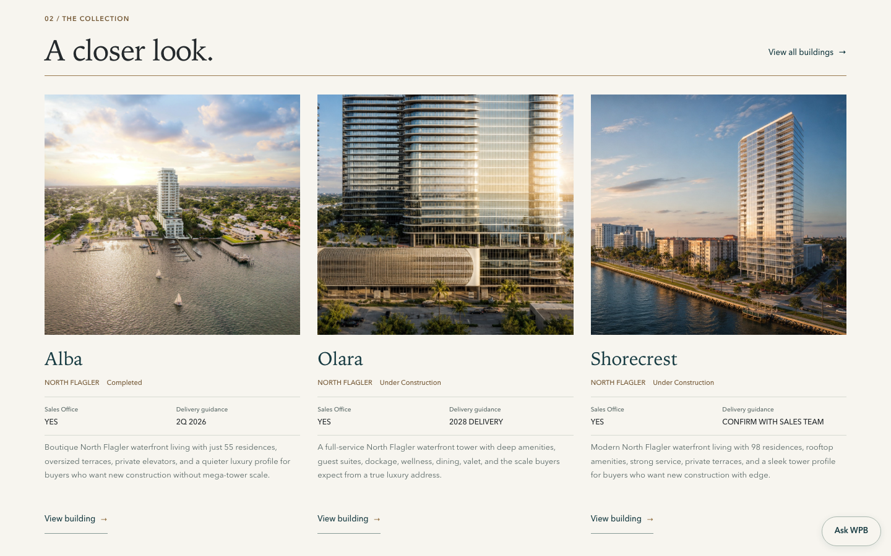
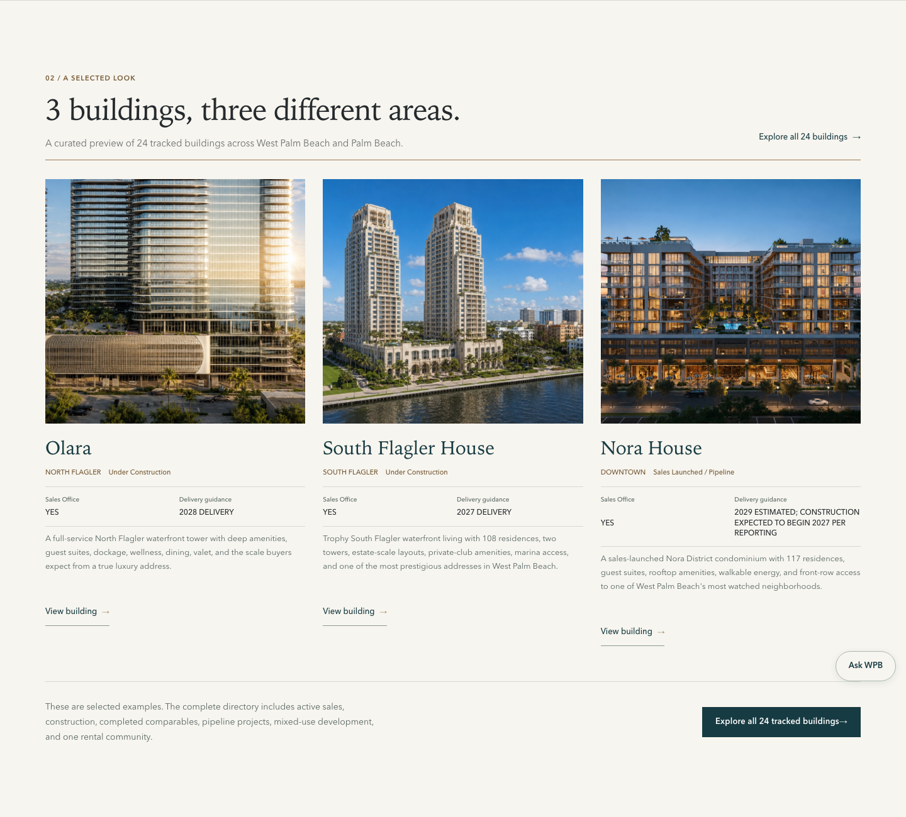
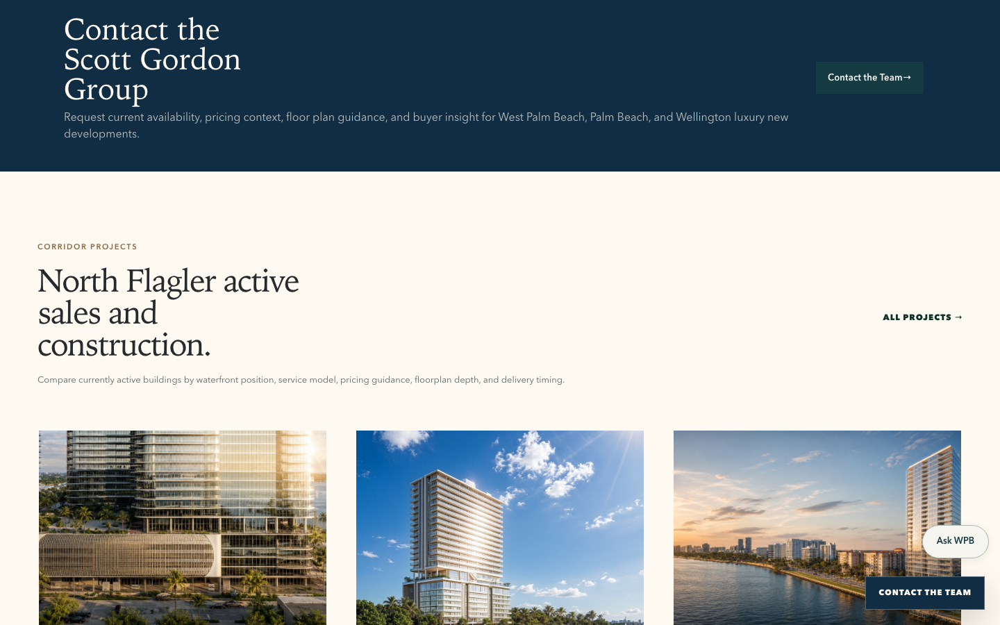
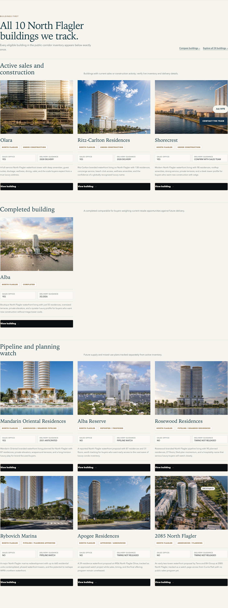
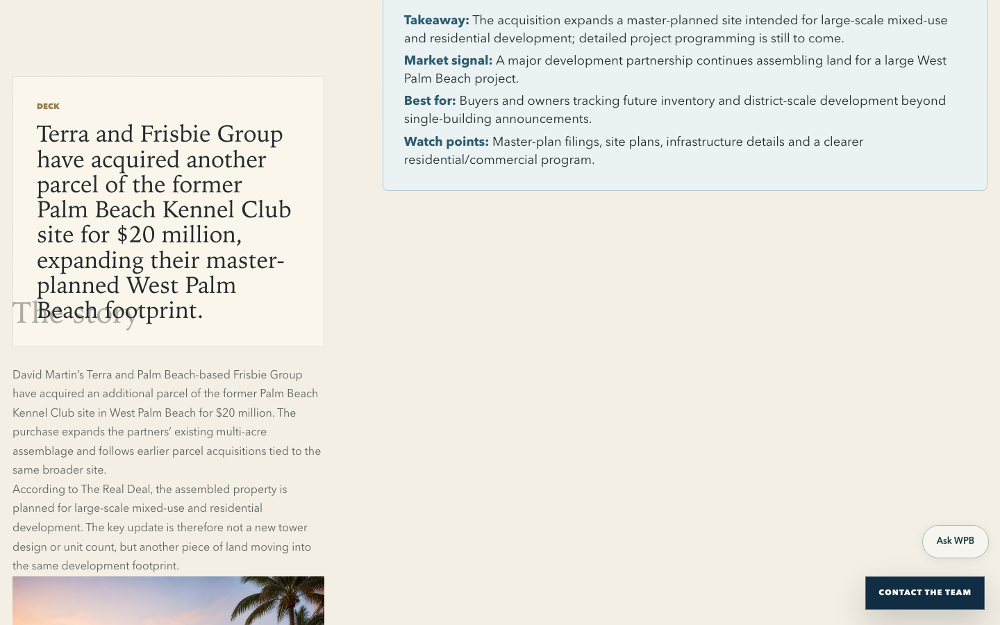
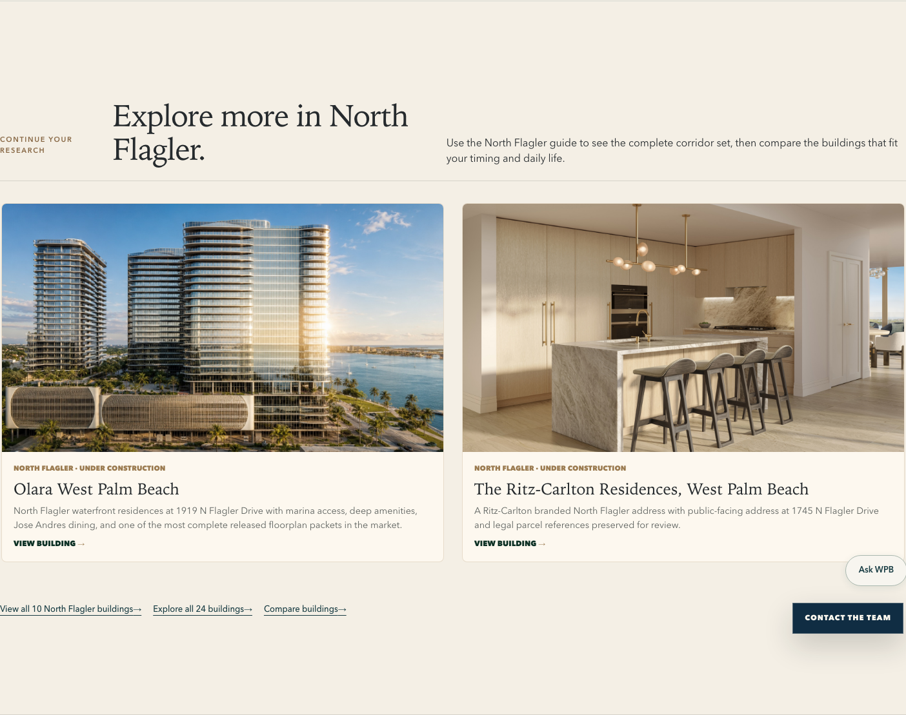
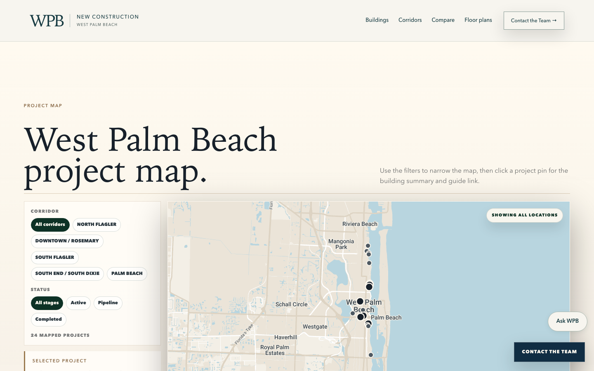
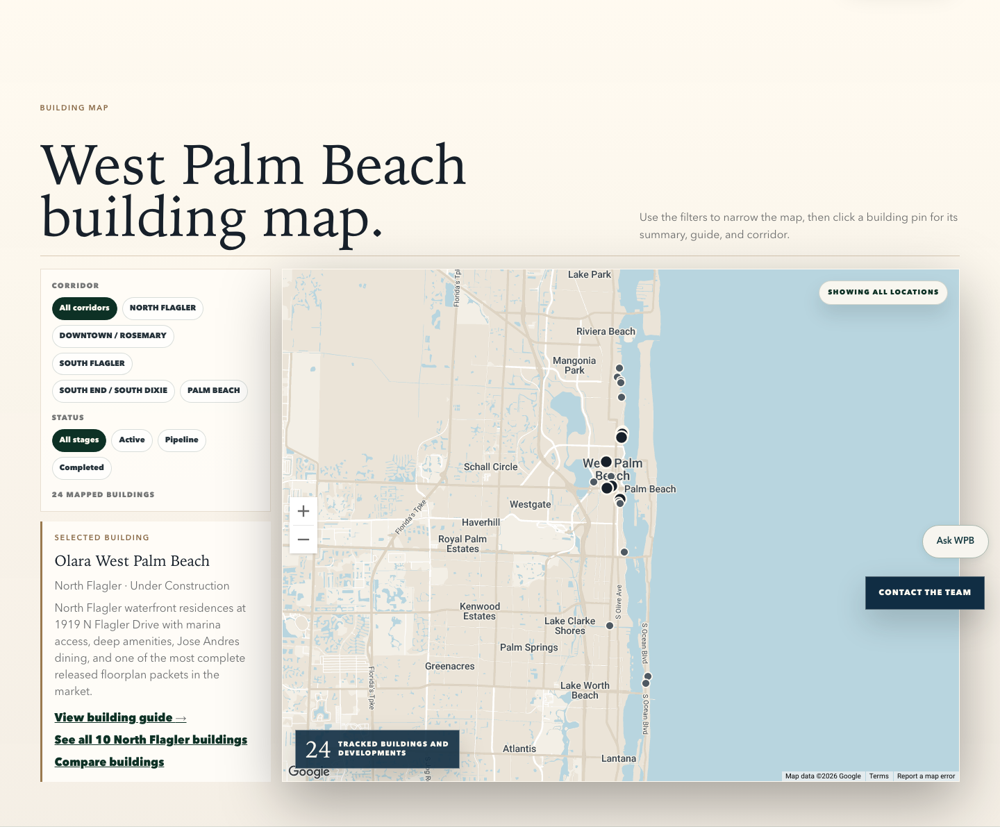

# Discovery and site-coherence milestone

This milestone continues draft PR #115 without changing the established hero, Development Desk, bridge artwork, canonical facts, publishing pipeline or buyer-flow contracts. It addresses one question: can a new visitor understand the site's scope and move naturally from discovery into research, comparison and inquiry?

## Highest-impact problems found

1. The homepage's three North Flagler cards could be mistaken for the complete collection. The complete 24-building directory and the map were visually weak destinations.
2. Corridor guides put research before the building collection. North Flagler claimed ten tracked buildings but omitted completed Alba from its nine rendered cards.
3. Building pages, articles and the map had thin or inconsistent onward paths. “Projects,” “developments” and “buildings” described the same public collection in adjacent interfaces.
4. The active purple-lightning favicon and domain-like search label did not match the current WPB identity.
5. The first narrow-screen QA pass exposed a real 703 px authority-table overflow on North Flagler.

## Implemented discovery hierarchy

- The homepage now labels its image-led row as a three-building selection from three different areas, derives the 24-building total from public inventory, and offers “Explore all 24” before and after the cards.
- Representative cards are chosen by a stable canonical rule: one image-capable building from each of the three highest-count areas.
- The area guide now covers all five public areas, including the South End's explicitly labeled rental context, and shows an area count.
- Corridor pages put their full image-led building set immediately after the visual introduction. North Flagler groups active/construction, completed and pipeline/planning records and shows all ten exactly once.
- The public directory, map and relevant actions use “Buildings” as the primary label. The Active Sales filter keys off canonical project types.
- Building pages show a three-building corridor preview plus complete-corridor, cross-area comparison and all-building paths.
- Approved-news articles add a quiet continuation module. A related article can lead to its full corridor, relevant alternatives, all buildings and comparison; a broader story leads to the complete directory and comparison without inventing a corridor.
- The map exposes the selected building's guide, complete corridor set and comparison path.
- The mobile authority table is a keyboard-focusable horizontal-scroll region, containing the research table without causing page overflow.

## Journey evidence

| Journey | Result |
|---|---|
| Homepage → all buildings | The selected row states `3 buildings`, `three different areas` and `24 tracked buildings`; two visible actions reach the complete directory. |
| Corridor → complete set | North Flagler presents all ten cards immediately after its introduction, with Alba in the completed group. |
| Building → alternatives | Olara presents Ritz-Carlton, Shorecrest and Alba, then links to all ten North Flagler buildings, comparison and all 24. |
| Article → building discovery | The Alba update continues to North Flagler alternatives, all ten corridor buildings, all 24 buildings and comparison. |
| Map → building/corridor | The selected Olara panel links to its guide, all ten North Flagler buildings and comparison. |

[Inventory reconciliation](inventory-reconciliation.md) records the independent 24-building proof and exact corridor/type totals. [Search identity evidence](search-identity.md) records metadata, reproducible icon sources and the post-deployment Search Console step.

## Before and after

The before images were captured from starting head `c2b2a00c01da5f46299d32092d0525e3b8fcd14c`. The after directory contains 40 captures: Chromium and WebKit at 1440×900 and 390×844 for the changed journeys and final correction checks. The capture helper warms lazy images in the browser and hides the already-tested skip link only for clean visual evidence.

| Before | After |
|---|---|
|  |  |
|  |  |
|  |  |
|  |  |

Mobile evidence includes the corrected [homepage collection](after/home-collection-mobile-chromium.png), [North Flagler inventory](after/north-flagler-full-inventory-mobile-chromium.png), [Olara alternatives](after/olara-alternatives-mobile-chromium.png), [article continuation](after/article-discovery-mobile-chromium.png) and [selected map panel](after/map-selected-mobile-chromium.png).

The bounded final-review corrections are shown in the [neutral newest-article path](after/newest-article-neutral-discovery-desktop-chromium.png) and [cross-area comparison](after/olara-cross-area-comparison-desktop-chromium.png), with matching mobile and WebKit captures beside them.

## Search identity

The editable square WPB source and its derived SVG, PNG, ICO and Apple assets replace every active purple icon reference. The built homepage keeps the existing `WebSite` entity and adds `alternateName` and `og:site_name`; page-specific titles and the canonical homepage are unchanged. Actual-size 16/24/32/48/96 px and illustrative circular-crop evidence is in [the icon preview](brand/favicon-size-preview.png). The local production-preview responses use correct SVG, PNG, ICO and web-manifest MIME types.

## Focused correction rounds

1. The structural/browser round moved complete building sets forward, restored Alba to North Flagler, added continuation paths, and found the corridor authority table extending the document at 390, 375 and 320 px. The table is now contained in an accessible horizontal-scroll region; the full discovery suite passes at desktop, tablet and all three phone widths.
2. The final buyer/visual round corrected the newest story's overly broad corridor inference, made the Olara comparison genuinely cross-area with corridor-aware labels, and stacked the 390 px homepage collection action beneath its introduction. Fresh Chromium and WebKit captures verify all three corrections.

The final independent Sol extra-high review is a **GO** with no release-blocking issue in its bounded recheck: discovery clarity 9.3/10, buyer UX 9.1/10 and art direction 9.0/10. [Final review](final-review.md) records the evidence and remaining limits.

## Verification and limits

Final local results:

- `npm run build`: pass, including typecheck and 117-route postbuild processing; the existing >500 kB main-chunk advisory remains.
- `npm run qa:discovery-coherence`: 36/36 across Chromium and WebKit; canonical 24 total and 10/5/6/2/1 area counts; 1440, 1024, 390, 375 and 320 overflow checks.
- `npm run qa:search-identity`: pass; eight PNG outputs, five active icon references, no active old-purple reference.
- `npm run qa:final-integration-gaps`: 54/54, including direct/reload/Back, static hero, reduced motion, Alba status, comparison and intercepted inquiry context.
- `npm run test:homepage-news-fixtures`: 6/6; Development Desk order/date/pipeline behavior preserved.
- Actual icon response dimensions and MIME types were verified from the built local preview.

The Google Maps and Google Fonts subrequests that were cancelled when sequential capture pages closed are browser teardown noise; no page or console error remained. Physical-device Safari, field performance, Google's eventual search-result presentation and post-deployment Search Console recrawl remain unverified. The South End image is geographic context, not a photograph of The Sound. No generated architectural image was added in this milestone.

Implementation source: `f826ceb3a6dece8bb5424d02995c15069119177a`. The later evidence commit contains documentation and captures only. Exact final pushed-head and CI identity are recorded in the draft PR handoff because this document is part of that pushed head.

No merge or deployment was performed.
