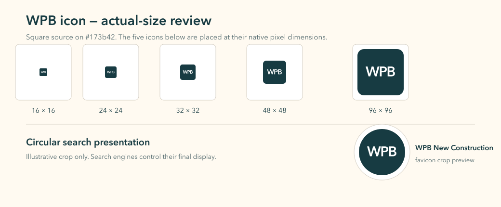

# Search identity and icon evidence

## Implemented identity

- Existing `WebSite` structured data remains the single site entity.
- `name`: `WPB New Construction`.
- `alternateName`: `West Palm Beach New Construction`.
- `og:site_name`: `WPB New Construction`.
- The canonical homepage URL and page-specific titles remain unchanged.
- No brokerage or advisor entity was renamed.

## Icon set

The old active purple-lightning icon was replaced by a dedicated square deep-teal (`#173b42`) mark with white `WPB` lettering. The editable source is `public/brand/wpb-favicon-source.svg`; `scripts/build-brand-icons.mjs` and `scripts/build-brand-favicon-ico.py` reproduce the browser assets.

Generated sizes are 16, 24, 32, 48, 96, 192 and 512 px PNG, a 16/32/48 px multi-frame ICO, and a 180 px Apple touch icon. `public/site.webmanifest` declares the 192 and 512 px application icons. The visual basis is the established on-site WPB masthead identity; no project photograph, architectural rendering or AI-generated imagery is involved.

The circular treatment above is an illustrative crop only. Search engines control the final displayed favicon and site name.

## Release follow-up

After an approved deployment, verify the public homepage and icon responses, then request a homepage recrawl/indexing review in Google Search Console. Do not request indexing for this local preview. These changes improve the eligible signals but cannot guarantee Google's displayed label or favicon.
